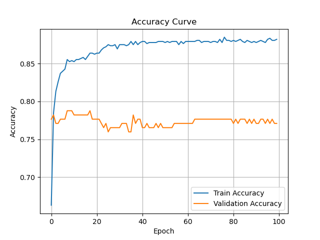
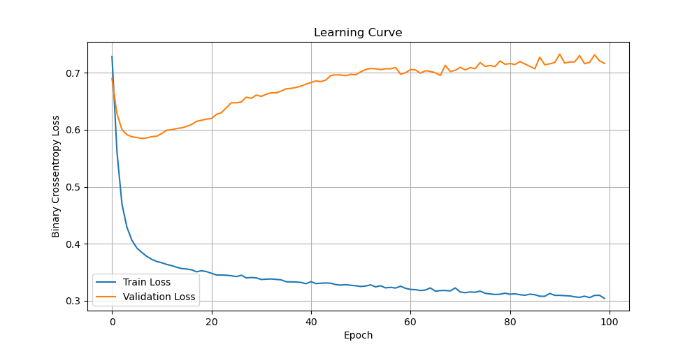
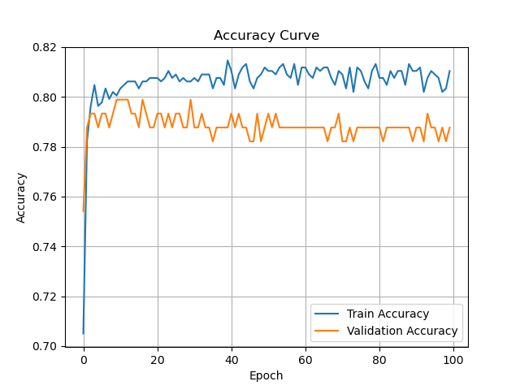
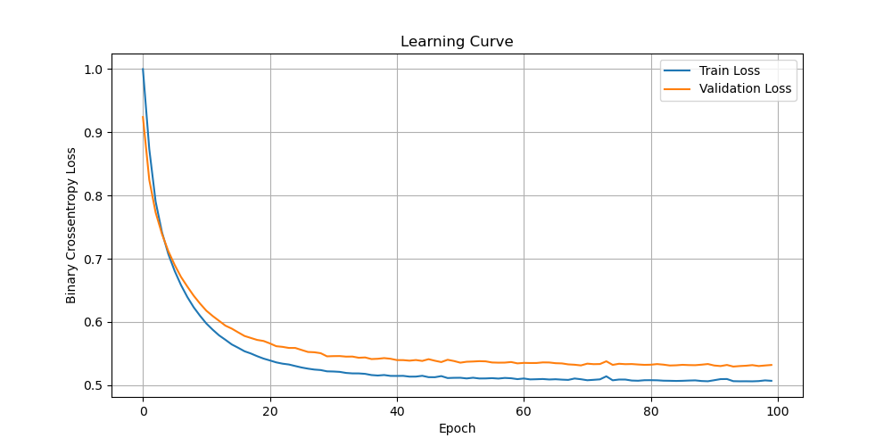

# Titanic - Kaggle competition

## First try - Score：0.74162 /  Rate: 14044

use Sex,Age,family=SibSp+Parch+1,SocialClass=Fare/Pclass,Cabin as feature

Analyse: **high variance** and **overfitting** !

## Second try - Score：0.76794 /  Rate: 10523

Based on first-try's Analyse, changes are below:
1. use less features
2. use feature-regularizer

use Sex,Age,family=SibSp+Parch+1,SocialClass=Fare/Pclass as feature

use 

    model = tf.keras.models.Sequential([
        tf.keras.layers.Dense(64, activation='relu', kernel_regularizer=L2(0.001)),
        tf.keras.layers.Dense(16, activation='relu', kernel_regularizer=L2(0.001)),
        tf.keras.layers.Dense(1, activation='sigmoid', kernel_regularizer=L2(0.001)),
    ])

instead of

    model = tf.keras.models.Sequential([
        tf.keras.layers.Dense(64, activation='relu'),
        tf.keras.layers.Dense(16, activation='relu'),
        tf.keras.layers.Dense(1, activation='sigmoid'),
    ])

